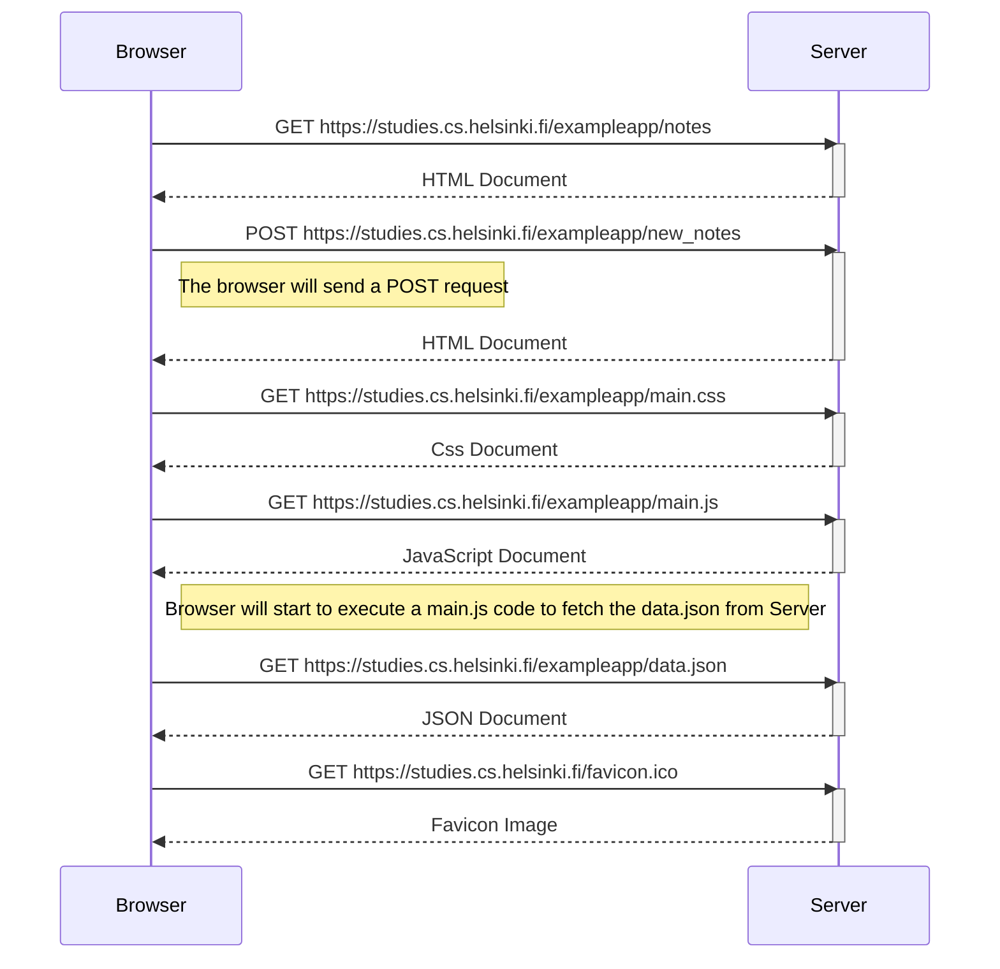

```mermaid

sequenceDiagram
    participant Browser
    participant Server

   Browser->>Server: GET https://studies.cs.helsinki.fi/exampleapp/notes
    activate Server
    Server-->>Browser: HTML Document
    deactivate Server

    Browser->>Server: POST https://studies.cs.helsinki.fi/exampleapp/new_notes
    activate Server
    Note right of Browser: The browser will send a POST request
    Server-->>Browser: HTML Document
    deactivate Server

    Browser->>Server: GET https://studies.cs.helsinki.fi/exampleapp/main.css
    activate Server
    Server-->>Browser: Css Document
    deactivate Server

    Browser->>Server: GET https://studies.cs.helsinki.fi/exampleapp/main.js
    activate Server
    Server-->>Browser: JavaScript Document
    deactivate Server

    Note right of Browser: Browser will start to execute a main.js code to fetch the data.json from Server

    Browser->>Server: GET https://studies.cs.helsinki.fi/exampleapp/data.json
    activate Server
    Server-->>Browser: JSON Document
    deactivate Server

    Browser->>Server: GET https://studies.cs.helsinki.fi/favicon.ico
    activate Server
    Server-->>Browser: Favicon Image
    deactivate Server
```
